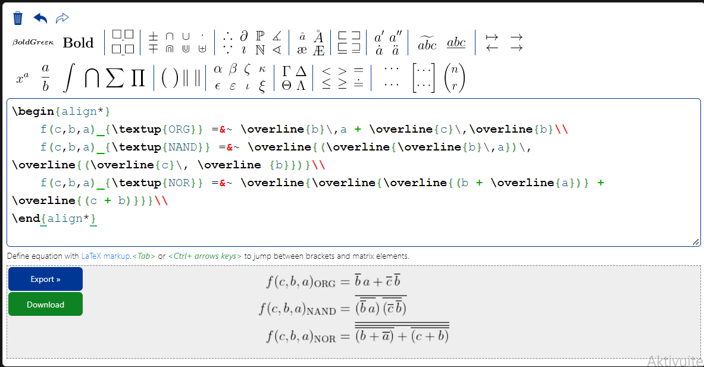
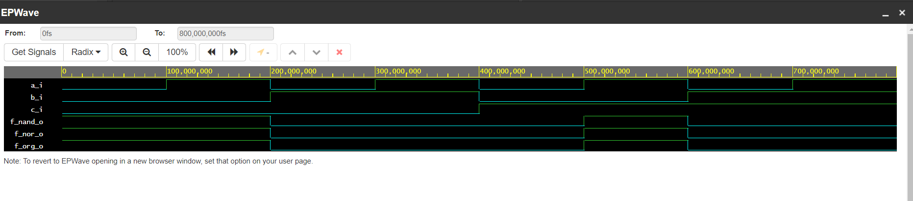
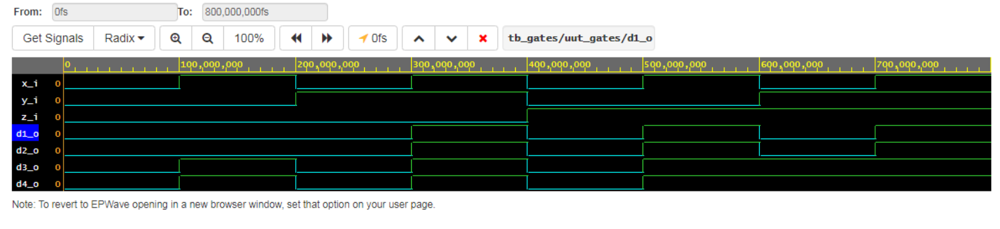

# Lab 1: Radek Vomočil

### De Morgan's laws

1. Equations of all three versions of logic function f(c,b,a):

   

2. Listing of VHDL architecture from design file (`design.vhd`) for all three functions. Always use syntax highlighting, meaningful comments, and follow VHDL guidelines:

```vhdl
architecture dataflow of gates is
begin
    f_org_o  <= (not(b_i) and a_i) or (not(c_i) and not(b_i));
    f_nand_o <= not((not(not(b_i) and a_i)) and (not(not(c_i) and not(b_i))));
    f_nor_o  <= not(not((not(b_i or not(a_i))) or (not(c_i or b_i))));
end architecture dataflow;
```


3. Complete table with logic functions' values:

| **c** | **b** |**a** | **f(c,b,a)_ORG** | **f(c,b,a)_NAND** | **f(c,b,a)_NOR** |
| :-: | :-: | :-: | :-: | :-: | :-: |
| 0 | 0 | 0 | 1 | 1 | 1 |
| 0 | 0 | 1 | 1 | 1 | 1 |
| 0 | 1 | 0 | 0 | 0 | 0 |
| 0 | 1 | 1 | 0 | 0 | 0 |
| 1 | 0 | 0 | 0 | 0 | 0 |
| 1 | 0 | 1 | 1 | 1 | 1 |
| 1 | 1 | 0 | 0 | 0 | 0 |
| 1 | 1 | 1 | 0 | 0 | 0 |

### Distributive laws

1. Screenshot with simulated time waveforms. Always display all inputs and outputs (display the inputs at the top of the image, the outputs below them) at the appropriate time scale!

```vhdl
   architecture dataflow of gates is
begin
    d1_o  <= (x_i and y_i) or (x_i and z_i);
    d2_o  <= x_i and (y_i or z_i);
    d3_o  <= (x_i or y_i) and (x_i or z_i);
    d4_o  <= x_i or (y_i and z_i);
   
end architecture dataflow;
```

2. Link to your public EDA Playground example:

   [https://www.edaplayground.com/...](https://www.edaplayground.com/x/8iEN)
