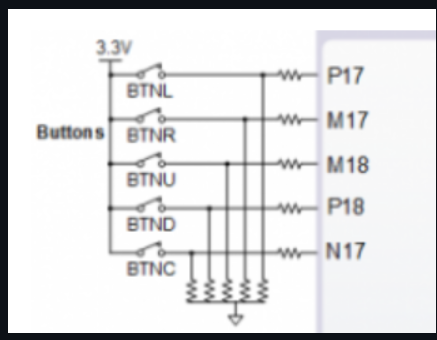

#### In this position the button is open. The input (for example P17) is log 0 (0V / GND). If we press the button bring to input P17 log 1 (3,3V). 
 | **Time interval** | **Number of clk periods** | **Number of clk periods in hex** | **Number of clk periods in binary** |
   | :-: | :-: | :-: | :-: |
   | 2&nbsp;ms | 200 000 | `x"3_0d40"` | `b"0011_0000_1101_0100_0000"` |
   | 4&nbsp;ms | 400 000 | `x"6_1A80"`     | `b"1100001101010000000"` |
   | 10&nbsp;ms | 1 000 000 | `x"F_4240"`     | `b"11110100001001000000"`               |
   | 250&nbsp;ms | 25 000 000    | `x"17D_7840"`   | `b"1011111010111100001000000"`          |
   | 500&nbsp;ms | 50 000 000    | `x"2FA_F080"`   | `b"10111110101111000010000000"`         |
   | 1&nbsp;sec | 100 000 000   | `x"5F5_E100"`   | `b"0101_1111_0101_1110_0001_0000_0000"` |
